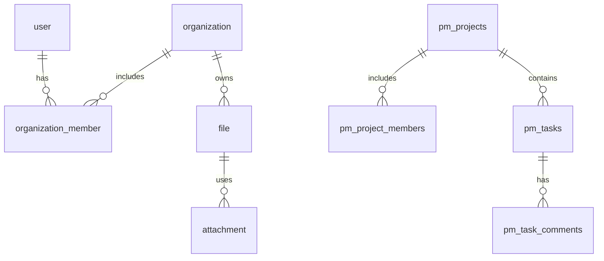

# Архитектура базы данных Collabverse

**Последнее обновление:** 2026-01-07  
**Статус:** Актуально  
**Владелец:** engineering

## Обзор

Платформа Collabverse использует PostgreSQL (Vercel Postgres) как основное хранилище данных. Архитектура следует принципу "БД как единственный источник истины" с использованием памяти только для кэширования.

## Канонические таблицы

### Проекты и задачи

**Канонические таблицы (единственный источник истины):**

- `pm_projects` - проекты (создается динамически через `pm-pg-adapter.ts`)
- `pm_tasks` - задачи (создается динамически через `pm-pg-adapter.ts`)
- `pm_project_members` - участники проектов
- `pm_task_comments` - комментарии к задачам
- `pm_project_chat_messages` - сообщения в чатах проектов

**Deprecated таблицы:**

- `project` (Drizzle схема) - **НЕ ИСПОЛЬЗУЕТСЯ**, помечена как `@deprecated`
  - См. [ADR-0001: Канонические таблицы](./adr/0001-canonical-database-tables.md) для деталей

### Пользователи и организации

**Drizzle схемы (канонические):**

- `user` - пользователи
- `organization` - организации
- `organization_member` - члены организаций
- `account` - OAuth аккаунты
- `session` - сессии пользователей
- `userControl` - роли и права пользователей

## Стратегия хранения данных

### Принцип: БД как единственный источник истины

1. **БД** - канонический источник всех данных
2. **Память** - используется только как кэш (cache-aside паттерн)
3. **Репозитории** - читают из БД, обновляют кэш

### Cache-aside паттерн

**Принцип:** Память используется только как кэш для оптимизации чтения данных. БД — единственный источник истины.

**Чтение:**
```text
1. Проверка кэша (память)
2. Если промах → чтение из БД
3. Запись в кэш для последующих запросов
```

**Запись:**
```text
1. Запись в БД
2. Инвалидация кэша (или обновление кэша)
```

**Детали:** См. [ADR-0002: Cache-aside паттерн](./adr/0002-cache-aside-pattern.md) для полного описания решения и его последствий.

### Репозитории

Все репозитории следуют единому паттерну:

- **Чтение:** Если БД включена → читать из БД, обновлять кэш. Fallback на память если БД недоступна.
- **Запись:** Запись в БД, затем обновление/инвалидация кэша.

**Примеры:**
- `ProjectsRepository.list()` - читает из `pm_projects`
- `TasksRepository.list()` - читает из `pm_tasks`
- `OrganizationsRepository.findById()` - читает из `organization` (Drizzle)

## Миграции

### Drizzle миграции

Миграции для Drizzle схем находятся в `apps/api/src/db/migrations/`:

- `0000_lying_mauler.sql` - базовые таблицы (users, accounts, sessions, userControl, project)
- `0001_chemical_lake.sql` - организации, проекты, шаблоны
- `0005_yellow_hardball.sql` - нормализация organization_member.user_id

**Применение миграций:**
```bash
# Генерация миграций
pnpm --filter @collabverse/api db:generate

# Применение миграций (push)
pnpm --filter @collabverse/api db:push
```

### Динамические таблицы (pm_*)

Таблицы `pm_projects`, `pm_tasks` и другие создаются автоматически при первом обращении через `ensurePmTables()` в `pm-pg-adapter.ts`.

**Не требуют миграций** - создаются через `CREATE TABLE IF NOT EXISTS`.

**Важно:** Эти таблицы являются каноническими для проектов и задач. См. [ADR-0001: Канонические таблицы](./adr/0001-canonical-database-tables.md).

## Переменные окружения

### Обязательные

- `POSTGRES_URL` - строка подключения к PostgreSQL
- `AUTH_STORAGE` - режим хранения: `db` (БД) или `memory` (память, только для dev)

### Опциональные

- `USE_DB_STORAGE` - включение/выключение БД для проектов/задач (по умолчанию включено, если `DATABASE_URL` установлен)

## Паттерны работы с данными

### 1. Всегда используй репозитории

❌ **Неправильно:**
```typescript
// Прямой SQL вне репозитория
await sql.query('INSERT INTO pm_projects ...');
```

✅ **Правильно:**
```typescript
// Через репозиторий
await projectsRepository.create({ ... });
```

### 2. Транзакции для критических операций

✅ **Правильно:**
```typescript
await db.transaction(async (tx) => {
  await tx.insert(organizations).values({ ... });
  await tx.insert(organizationMembers).values({ ... });
});
```

### 3. Валидация перед записью

✅ **Правильно:**
```typescript
// Валидация через Zod
const parsed = createProjectSchema.safeParse(input);
if (!parsed.success) {
  throw new ValidationError(parsed.error);
}

// Затем запись через репозиторий
await projectsRepository.create(parsed.data);
```

### 4. Проверка существования перед созданием

✅ **Правильно:**
```typescript
const org = await organizationsRepository.findById(orgId);
if (!org) {
  throw new NotFoundError(`Organization not found: ${orgId}`);
}
// Затем создание проекта
```

## Безопасность

### 1. Параметризованные запросы

✅ **Всегда используй параметризованные запросы:**
```typescript
await sql.query('SELECT * FROM pm_projects WHERE id = $1', [projectId]);
```

❌ **Никогда не используй конкатенацию строк:**
```typescript
// ОПАСНО!
await sql.query(`SELECT * FROM pm_projects WHERE id = '${projectId}'`);
```

### 2. Проверка прав доступа

✅ **Всегда проверяй права доступа:**
```typescript
const hasAccess = await projectsRepository.hasAccess(projectId, userId);
if (!hasAccess) {
  throw new ForbiddenError('Access denied');
}
```

### 3. Tenant-ключи

✅ **Всегда используй tenant-ключи для фильтрации:**
```typescript
// Фильтрация по organization_id
const projects = await projectsRepository.list({ organizationId });
```

## Мониторинг и диагностика

### Скрипты проверки

- `scripts/sync-organization-to-db.ts` - синхронизация организации с БД
- `scripts/comprehensive-data-audit.ts` - аудит расположения данных
- `scripts/check-organization-status.ts` - проверка статуса организаций

### Логирование

Репозитории логируют операции:
- `[ProjectsRepository] Loaded project from DB: id=...`
- `[OrganizationsDbRepository] Error loading organization: ...`

## Troubleshooting

### Проблема: Репозитории возвращают пустые списки

**Причина:** Данные в БД, но репозитории читают из памяти (которая пуста).

**Решение:** Убедись, что:
1. `AUTH_STORAGE=db` установлен
2. `POSTGRES_URL` настроен
3. Репозитории обновлены для чтения из БД (см. `ProjectsRepository.list()`)

### Проблема: Организация "исчезает" при перезапуске

**Причина:** Организация существует только в памяти, не в БД.

**Решение:** Запусти `scripts/sync-organization-to-db.ts` для синхронизации.

### Проблема: Проекты не создаются

**Причина:** Возможно, используется deprecated таблица `project` вместо `pm_projects`.

**Решение:** Убедись, что используется `ProjectsRepository.create()`, который записывает в `pm_projects`.

## Связи между таблицами

### Основные связи

**Пользователи и организации:**
- `user` → `organization_member` → `organization` (многие ко многим)
- `user` → `account` (NextAuth OAuth аккаунты, один ко многим)
- `user` → `user_subscription` (лимиты подписки, один к одному)

**Проекты и задачи (pm_*):**
- `pm_projects.workspace_id` — логический идентификатор workspace (FK отсутствует)
- `pm_projects` → `pm_tasks` (один ко многим)
- `pm_tasks` → `pm_tasks` (self-reference для иерархии через `parent_task_id`)
- `pm_projects` → `pm_project_members` → `user` (многие ко многим)
- `pm_tasks` → `pm_task_comments` (один ко многим)

**Шаблоны:**
- `user_project_templates` → `project_template_tasks` (один ко многим)

**Файлы:**
- `organization` → `file` (один ко многим)
- `file` → `attachment` (один ко многим)
- `file.folder_id` → `folder` (опциональная связь)
- `file.project_id` ссылается на deprecated `project` (NEEDS_CONFIRMATION миграции к `pm_projects`)

**Диаграмма (упрощенная):** pm_* таблицы создаются динамически, `workspace_id` не имеет FK.


Подробнее о реляционной модели см. [`./system-analysis.md`](./system-analysis.md#доменные-сущности-и-связи).

## Связанные документы

### ADR решения

- [ADR-0001: Канонические таблицы](./adr/0001-canonical-database-tables.md) - решение о канонических таблицах `pm_projects` и `pm_tasks`
- [ADR-0002: Cache-aside паттерн](./adr/0002-cache-aside-pattern.md) - решение об использовании cache-aside паттерна для чтения данных
- [ADR-0005: Мультиаккаунт](./adr/0005-multi-account-model.md) - решение о модели мультиаккаунта через Organizations и Workspaces

### Другие документы

- [Системный анализ](./system-analysis.md) - детальный анализ системы и реляционная модель
- [Отчет аудита данных](../audit/DATA_LOCATION_AUDIT_REPORT.md) - аудит расположения данных
- [Руководство по очистке БД](../runbooks/DATABASE_CLEANUP_GUIDE.md) - руководство по очистке БД
