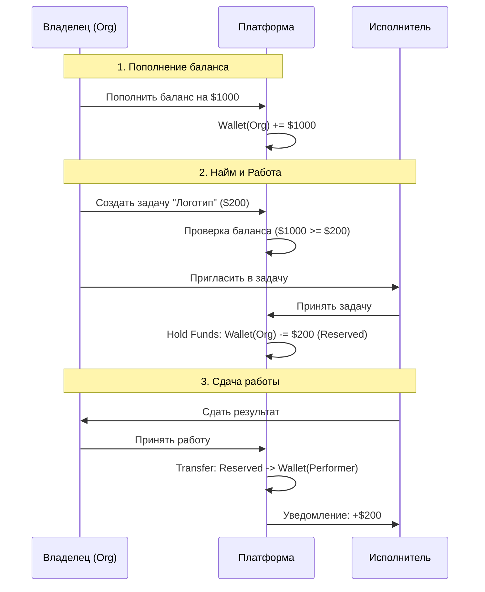

# План реализации Финансовой Экосистемы (Organization & Performer Finance)

Этот документ описывает архитектуру и этапы реализации внутренней финансовой системы платформы.
**Главная цель:** Создать замкнутый контур движения средств, где Организации пополняют бюджет и оплачивают работу, а Исполнители получают вознаграждение на внутренний баланс.

---

## 1. Архитектура Базы Данных (Backend)

Необходимо внедрить сущности для хранения балансов и истории транзакций. Мы используем подход **Ledger (Журнал)** для обеспечения целостности данных.

### 1.1. Новые таблицы (`apps/api/src/db/schema.ts`)

1.  **`wallets` (Кошельки)**
    *   `id`: PK.
    *   `entityId`: ID владельца (User ID для исполнителя или Organization ID для компании).
    *   `entityType`: 'user' | 'organization'.
    *   `balance`: BigInt (храним в центах/копейках для точности).
    *   `currency`: 'USD' | 'RUB' (по умолчанию RUB).
    *   `status`: 'active' | 'frozen'.

2.  **`transactions` (Транзакции)**
    *   `id`: PK.
    *   `walletId`: FK на `wallets`.
    *   `type`: 'deposit' (пополнение), 'withdrawal' (вывод), 'payment' (оплата), 'refund' (возврат), 'payout' (выплата исполнителю).
    *   `amount`: BigInt (+ или -).
    *   `referenceId`: ID связанной сущности (Project ID, Task ID, Invoice ID).
    *   `referenceType`: 'project', 'task', 'stripe_charge'.
    *   `status`: 'pending', 'completed', 'failed'.
    *   `metadata`: JSON (детали).

3.  **`contracts` (Контракты/Офферы)**
    *   Связывает Задачу (Task), Исполнителя (User) и Стоимость.
    *   `status`: 'offer', 'accepted', 'funded' (деньги в холде), 'completed', 'paid', 'disputed'.
    *   `amount`: Сумма контракта.

---

## 2. Бизнес-логика и Сервисы (Backend)

### 2.1. Finance Service (`WalletService`)
Сервис должен поддерживать **ACID-транзакции**. Любое изменение баланса должно быть атомарным.

*   `createWallet(entityId, type)`: Создание кошелька при регистрации юзера или создании организации.
*   `getBalance(walletId)`: Получение текущего баланса.
*   `topUpOrganization(orgId, amount)`: Пополнение счета организации (эмуляция или интеграция Stripe).
*   `holdFunds(orgId, amount, taskId)`: "Заморозка" средств под задачу (Escrow). Деньги списываются с доступного баланса организации, но еще не перечисляются исполнителю.
*   `releaseFunds(taskId)`: Завершение задачи -> перевод средств из "холда" на кошелек Исполнителя.

### 2.2. Project Budget Logic
*   При создании Проекта внутри Организации указывается **Бюджет Проекта**.
*   Логика: `Project Budget <= Organization Available Balance`.
*   При создании задач внутри проекта, их стоимость вычитается из свободного бюджета проекта.

---

## 3. Пользовательский Интерфейс (Frontend)

### 3.1. Раздел "Финансы" для Организации (`/finance/wallet`)
*   **Карточка баланса:** Текущий баланс, Заморожено (в работе), Всего потрачено.
*   **Кнопка "Пополнить":** Модальное окно (для демо — просто ввод суммы, для продакшна — Stripe/Invoice).
*   **История операций:** Таблица всех списаний и пополнений с фильтрами по Проектам и Исполнителям.

### 3.2. Раздел "Финансы" для Исполнителя (`/finance/earnings`)
*   **Баланс:** Доступно к выводу, В ожидании (Pending clearance).
*   **Кнопка "Вывести":** Запрос на вывод средств.
*   **Статистика:** Доход за месяц/год.

### 3.3. Интеграция в Проекты и Задачи
*   **Создание задачи:** Добавить поле "Бюджет задачи" (Price).
*   **Приглашение исполнителя:** При отправке оффера проверять, хватает ли средств на кошельке Организации.
*   **Приемка работы:** Кнопка "Принять и Оплатить" для владельца проекта (триггерит `releaseFunds`).

---

## 4. Этапы реализации (Roadmap)

### Этап 1: Фундамент (Backend Data)
1.  [ ] Создать миграцию БД для `wallets`, `transactions`, `contracts`.
2.  [ ] Реализовать `WalletRepository` и базовый `FinanceService` с транзакциями.
3.  [ ] Создать API: `GET /api/finance/balance`, `POST /api/finance/top-up`.

### Этап 2: Интерфейс Организации (Org Finance)
1.  [ ] Обновить страницу `/org/[id]/billing` или создать `/org/[id]/finance`.
2.  [ ] Реализовать виджет баланса в сайдбаре или шапке для владельцев.
3.  [ ] Реализовать UI пополнения счета.

### Этап 3: Контракты и Оплата (Core Logic)
1.  [ ] Обновить модель Задач: добавить связь с `contracts`.
2.  [ ] Реализовать флоу:
    *   Организация создает задачу с ценой -> Создается запись `contract` (status: offer).
    *   Исполнитель принимает -> `contract` (status: accepted).
    *   Организация подтверждает старт -> С баланса списывается (холд) сумма -> `contract` (status: funded).
    *   Работа сдана -> Деньги переводятся исполнителю -> `contract` (status: paid).

### Этап 4: Интерфейс Исполнителя
1.  [ ] Страница "Мой кошелек".
2.  [ ] Уведомления о поступлении средств.

---

## 5. Схема потоков данных (Data Flow)

